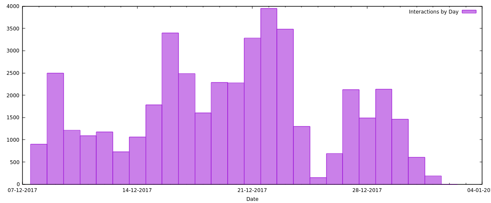
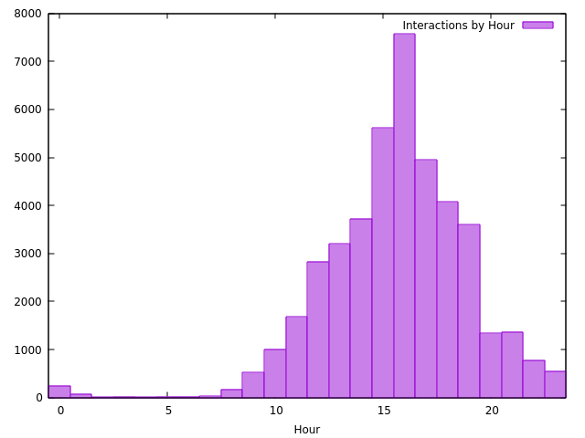

# Analytics

The [Controller](Controller) app will log all events and commands to a file called `activity.log`.

Each line of the log is in the format:

Host,Command,one or more command-specific parameters,Timestamp

## Basic Stats

Number of touches.

`egrep ^.,2 activity.log | wc`

However, that pulls in a ridiculous number of touches.  Poking around at the resultant data showed that lots were triggering very close to the threshold, which were most likely false readings.

Pulled together separate files for each touch sensor, e.g. for the first sensor on the third Teensy:

`egrep ^3,2,0 activity.log > press-3-0.csv`

Then looked at those as a scatter plot in gnuplot.  Running them through [readings-to-threshold.rb](readings-to-threshold.rb) with a low threshold filter value (to not actually filter anything) generated the `.dat` file to render with gnuplot.

That let us eyeball the data to strip out the noise by then setting a better value for the threshold and re-running the script.

The rest of the stats assumes you've done this for each sensor, and saved the data files as `trimmed-$host-$sensor.dat`

## Most Popular Sensor

Comparing the size of each of the `trimmed-*.dat` files will show the popularity of each sensor with a simple `wc`.

## Most Popular Day

Combining all of the sensors files will let us gather stats on days with...

`cat trimmed-*.dat | cut -f 1 -d T | sort | uniq -c`

And then plotted in gnuplot with...

```
  set xdata time
  set timefmt "%Y-%m-%d" # input format
  set format x "%d-%m-%Y" # output format
  set style fill solid 0.5
  set xlabel "Date"
  plot "days.dat" using 2:1 with boxes title "Interactions by Day"
```



## Most Popular Time of Day

Similarly, combining all of the sensors' files will let us gather stats on hours with...

`cat trimmed-*.dat | cut -f 2 -d T | cut -f 1 -d : | sort | uniq -c`

And then plotted in gnuplot with...

```
  set style fill solid 0.5
  set xlabel "Date"
  set xrange [-0.5:23.5]
  plot "hours.dat" using 2:1 with boxes title "Interactions by Hour"
```



